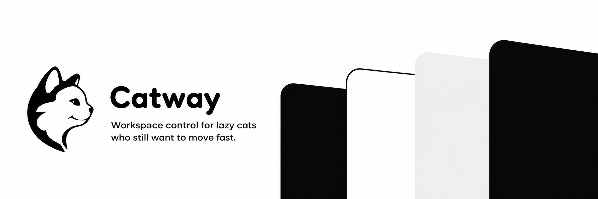

<p align="center">
  
</p>

<p align="center">
  <a href="https://github.com/TheCommandCat/catway/actions/workflows/ci.yml"></a>
  
  
  
  <a href="LICENSE"></a>
</p>

Catway is a small native macOS workspace wheel built around a simple idea: show every active workspace in one place, point in a direction, and click. It keeps the speed and tiling behavior of yabai while replacing the slow native Mission Control gesture with a cursor-centered radial view.

Catway is currently an early `0.1.0` release. Its packaging, rollback, tests, and config ownership are production-shaped; wider hardware and multi-display testing is still welcome before calling it `1.0`.

## What it does

- Four-finger swipe up opens an already-warm native Swift wheel.
- The wheel shows workspaces, not separate windows, and hides empty workspaces by default.
- Native four-finger horizontal swipes keep macOS's smooth, finger-following Space animation.
- `Option+Tab` cycles through every active workspace, and an optional active-only horizontal mode is available in Settings.
- Four fingers up opens the Catway wheel; four fingers down closes it.
- Workspace labels can be numbers or letters, with AeroSpace-style focus and move shortcuts.
- `Option+/` cycles the focused window through tiled positions from any panel.
- Double backtick toggles the wheel; a third backtick closes it.
- While the wheel is open, a bare label key such as `Z` or `V` switches directly.
- Clicking the small center stays on the current workspace.
- The wheel stays centered on the cursor even at a screen edge; off-screen portions are clipped.

## Architecture and dependencies

Catway is the Swift app, settings UI, workspace model, and reversible integration layer. It deliberately uses mature tools for privileged or specialized jobs:

- [yabai](https://github.com/asmvik/yabai) is the current window and native-Space engine.
- [skhd](https://github.com/asmvik/skhd) is optional and owns global keyboard shortcuts.
- [Hammerspoon](https://www.hammerspoon.org/) is optional and acts only as the global four-finger/double-backtick bridge.
- [SketchyBar](https://github.com/FelixKratz/SketchyBar) support is optional. Catway adds workspace items without replacing the user's bar or theme.
- `jq` is required by the fast shell command path.

The main configs remain user-owned. Catway adds one marked, removable include block to each enabled tool and writes only under `~/.config/catway`.

## Requirements

- macOS 13 or newer
- Xcode Command Line Tools / Swift 6
- yabai and jq
- Optional: skhd, Hammerspoon, SketchyBar

With Homebrew:

```bash
brew install yabai jq
brew install skhd sketchybar
brew install --cask hammerspoon
```

Follow yabai's official Accessibility setup. Grant Accessibility to Hammerspoon if you enable Catway gestures.

## Install

```bash
git clone https://github.com/TheCommandCat/catway.git
cd catway
./scripts/install.sh
```

The installer builds and ad-hoc signs `~/Applications/Catway.app`, installs the `catway` command under `~/.local/bin`, backs up configs before its first include, and opens Settings. It does not install dependencies or replace a user's dotfiles.

By default, Catway disables macOS's native four-finger vertical Mission Control gesture so it is not handled twice, while leaving the native horizontal Space animation enabled. Enabling **Active-only horizontal swipe** replaces that animation with Catway's discrete active-workspace cycling. Catway snapshots the original values first and restores everything on uninstall.

Run the health check afterward:

```bash
~/.local/bin/catway doctor
```

## Default controls

| Input | Action |
| --- | --- |
| Four-finger swipe up | Open Catway wheel |
| Four-finger swipe down | Close Catway wheel |
| Four-finger swipe left/right | Native previous/next macOS Space |
| Double backtick | Toggle Catway wheel |
| `Esc` or center click | Stay and dismiss |
| Bare workspace label in wheel | Focus that active workspace |
| `Option+Tab` | Next active workspace |
| `Option+Shift+Tab` | Previous active workspace |
| `Option+[label]` | Focus or create that dynamic workspace |
| `Option+Shift+[label]` | Move the focused window there |
| `Option+/` | Cycle focused window to next tiled position |
| `Option+H/J/K/L` | Focus tiled window by direction |
| `Option+Shift+H/J/K/L` | Move tiled window by direction |

The letter labels `H`, `J`, `K`, and `L` stay reserved for Vim-style directions.

## Settings and user-owned config

Open Settings with:

```bash
catway settings
```

Catway intentionally has no menu-bar icon. Use the gesture, double backtick, Spotlight, or `catway settings` instead.

Settings writes `~/.config/catway/settings.json` and regenerates only Catway-owned integration files. The loaded files are intentionally readable:

- `~/.config/catway/hammerspoon.lua`
- `~/.config/catway/catway.skhdrc`
- `~/.config/catway/yabai.sh`
- `~/.config/catway/sketchybarrc`
- `~/.config/catway/sketchybar.local.sh` — never overwritten; use this for colors and spacing

If a shortcut conflicts with your setup, turn off Catway keyboard shortcuts or edit the generated skhd file after applying Settings. For a lasting custom binding, put it in your main `skhdrc`; that file always remains yours.

## Brand assets

- `assets/catway-mark.svg` is the compact true-vector black-on-white mark.
- `assets/catway-logo.png` is the cleaned 1024px app-icon source.
- `assets/catway-process.png` is the 64px SketchyBar/process-item export.
- `assets/catway-banner.png` is the generated README hero.

Catway copies the small mark to `~/.config/catway/sketchybar/catway-process.png`. It does not attach the image to a user item automatically; `sketchybar.local.sh` includes an example so the user's bar remains user-owned.

## Build and test

```bash
swift test
./Tests/shell/integration.sh
./Tests/shell/install.sh
./Tests/shell/release.sh
./scripts/build-app.sh
codesign --verify --deep --strict build/Catway.app
```

Create a release archive:

```bash
./scripts/package-release.sh 0.1.0
```

Local builds use ad-hoc signing. Public binary distribution still requires a Developer ID signature and Apple notarization.

## Uninstall

```bash
~/.local/share/catway/scripts/uninstall.sh
```

This stops Catway, removes only Catway's marked include blocks and bar items, restores the native Mission Control preferences captured at install time, and leaves settings/backups in `~/.config/catway`.

To remove saved settings too:

```bash
~/.local/share/catway/scripts/uninstall.sh --purge
```

## Project status

Catway currently targets yabai. An AeroSpace backend is a sensible future addition because Catway's Swift workspace model is already separated from the window engine, but it is not implemented or claimed today.

See [Architecture](docs/ARCHITECTURE.md), [Troubleshooting](docs/TROUBLESHOOTING.md), and [Contributing](CONTRIBUTING.md).
